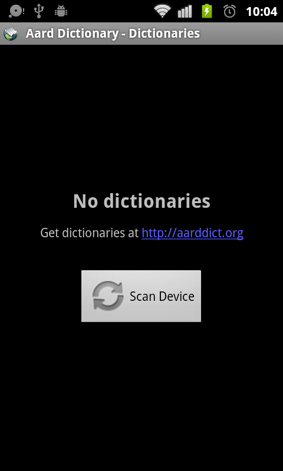
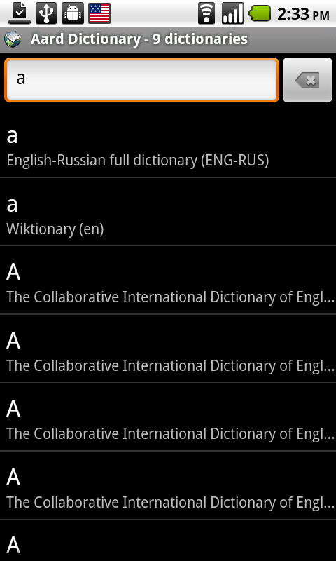
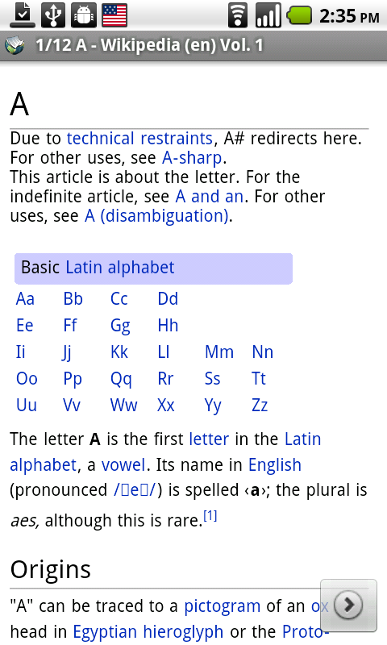
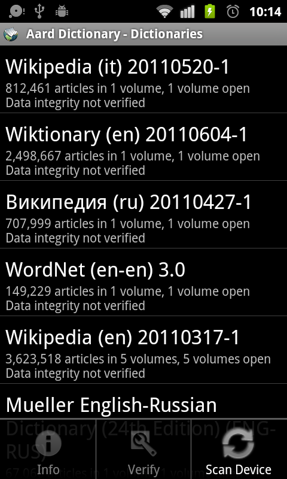
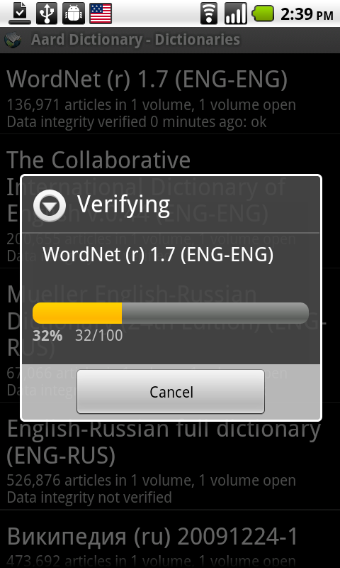

=============================
Aard Dictionary for Android
=============================

Overview
============

Aard Dictionary for Android is a port of Aard Dictionary to Android
(duh!). It uses same dictionaries as desktop version.

Aard Dictionary for Android consists of two main activities (`Lookup`,
`Article View`) and two auxiliary activities (`Dictionaries`,
`Dictionary Info`).

Application starts with `Lookup` activity. It goes through the list of
previously open dictionaries and loads them again. If no dictionaries
are open, user can device scan to find dictionaries.

.. note::

   Aard Dictionary is looking for files with :file:`.aar` extension
   by recursively scanning device's file system starting from
   :file:`/` (excluding some system directories
   such as :file:`/proc` or :file:`/etc`, hidden directories and ignoring
   symlinks), all dictionaries normally should be
   discovered by this process. However, dictionaries can also be
   opened manually from a file manager such as `Ghost
   Commander`_: navigate to the dictionary file to be opened, tap on
   it, choose `Aard Dictionary` to complete the action if prompted.

.. _Ghost Commander: http://www.androlib.com/android.application.com-ghostsq-commander-zniE.aspx

In `Lookup` activity simply start typing in the word lookup
box. Matching results will appear in the list below it. Scroll down to
see more lookup results, if available. Tap on an item in the list to
corresponding article.

If more than one article is available with the same or similar title
`Next` button appears in the bottom right corner on screen touch. Same
applies when user follows a link from an article: article from the
same dictionary will be loaded (if found), but if more than one is
found in all dictionaries user will be able to view them by tapping
the `Next` button.

Use device's `Back` button to go back (to previous article, or, if
there is no previous article, to `Lookup` activity screen). Use
device's `Search` button to close `Article View` activity screen and
go straight to `Lookup Activity`. If `Article View` was launched from
another application, closing `Article View` will return user to that
application instead.

Use `Zoom In` and `Zoom Out` menu items in `Article View` activity to
adjust article's text size.

Use device's volume control buttons to scroll article text and to
navigate to next/previous article. Volume down button will navigate to
the next article when article is already scrolled to the
bottom. Similarly, volume up button will navigate back when at the top.

Use `View Online` menu item to see online
version of current article in the web browser (this only works if
dictionary's metadata includes server URL as is usually the case with
Wikipedia, Wiktionary, Wikiquote and such).

View list of currently open dictionaries by opening menu in `Lookup`
activity and tapping `Dictionaries`.

Tap on an item (or select `Info`
in the menu) in the dictionary list to see dictionary's description,
license and copyright information (if available). Tap and hold (or
select `Verify` in the menu) to verify dictionary's data integrity.

.. note::

   `Info` and `Verify` menu items work when trackball is used for
   interaction (they need an item selected in the dictionary list, but
   selection disappears when touch is used).

Data integrity verification may take a very long time, especially on
large dictionaries and/or slow devices.

.. note::

   If data verification indicates that dictionary files are corrupted
   it means there were errors while downloading or copying the files
   to SD card or internal device storage. It may also point to bad
   hardware, such as defective SD card. You may need
   to download and/or copy dictionary files again, or replace SD card
   if defective. Dictionary data can also be verified using desktop
   version of Aard Dictionary to establish whether the error occurred
   during download or file transfer.

If more dictionaries were copied to device after Aard Dictionary
scanned it, it needs to be re-scanned for Aard Dictionary to pick up
new dictionaries. Select `Scan Device` menu item in `Dictionaries` to
do this. Alternatively, new dictionaries can be opened from a file
manager.

Initiating Lookup from Other Applications
=========================================
Many applications implement `Share` action so that selected text can
be sent to other applications. Since version 1.6.4 Aard Dictionary
should appear in the list of applications that can receive shared
text.

Alternatively, word lookup may be initiated
directly in Aard Dictionary with the following:

.. code-block:: java

   Intent intent = new Intent();
   intent.setClassName("aarddict.android", "Article");
   intent.setAction(Intent.ACTION_SEARCH);
   intent.putExtra(SearchManager.QUERY, word);
   startActivity(intent);

This should take user immediately to the article with best matching
title, or to look up screen if nothing found so that user has a chance
to modify entry.

Contributors
============

- Iryna Gerasymova (Aard Dictionary logo, testing)

- Igor Tkach (`SDict Viewer`_ and Aard Dictionary author)

- Jeff Doozan (EInk display support, fixes)

- Chinese translation by `bbs.goapk.com`_

- French translation by Riad Benchoucha

- German translation by dliw_

.. _SDict Viewer: http://sdictviewer.sourceforge.net
.. _bbs.goapk.com: http://bbs.goapk.com
.. _dliw: https://github.com/dliw

Reporting Issues
================

Please submit issue reports and enhancement requests to `Aard
Dictionary for Android issue tracker`_.

.. _Aard Dictionary for Android issue tracker: http://github.com/aarddict/android/issues

