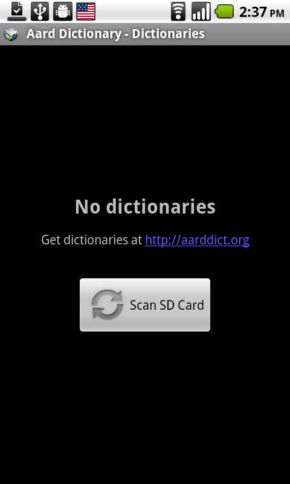
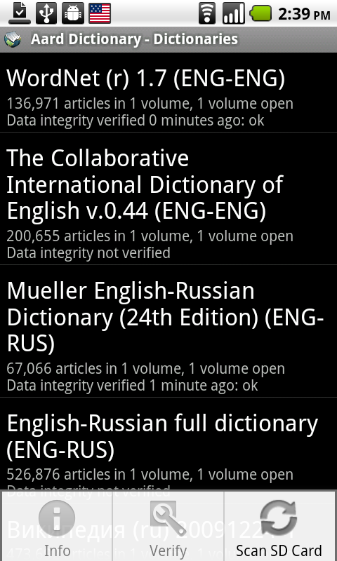

=============================
Aard Dictionary for Android
=============================

Overview
============

Aard Dictionary for Android is a port of Aard Dictionary to Android
(duh!). It uses same dictionaries as desktop version.

Aard Dictionary for Android consists of two main activities (`Lookup`,
`Article View`) and two auxiliary activities (`Dictionaries`,
`Dictionary Info`).

Application starts with `Lookup` activity. It goes through the list of
previously open dictionaries and loads them again. If no dictionaries
are open, user can initiate SD card scan to find dictionaries.

.. note::

   Aard Dictionary is looking for files with :file:`.aar` extension on
   device's external storage. External storage is typically SD card
   (with corresponding file system path being :file:`/sdcard`). Some
   Android devices also have internal storage which may be mounted as
   a subdirectory of external storage (in which case dictionaries will
   be found there) or separately (in which cases dictionaries will
   *not* be found). Dictionaries that are stored outside of external
   storage can still be opened from a file manager such as `Ghost
   Commander`_: navigate to the dictionary file to be opened, tap on
   it, choose `Aard Dictionary` to complete the action if prompted.

.. _Ghost Commander: http://www.androlib.com/android.application.com-ghostsq-commander-zniE.aspx

In `Lookup` activity simply start typing in the word lookup
box. Matching results will appear in the list below it. Scroll down to
see more lookup results, if available. Tap on an item in the list to
corresponding article.

.. image:: aarddict-android-1.1-lookup.png
   :scale: 50
   
If more than one article is available with the same or similar title
`Next` button appears in the bottom right corner on screen touch. Same
applies when user follows a link from an article: article from the
same dictionary will be loaded (if found), but if more than one is
found in all dictionaries user will be able to view them by tapping
the `Next` button.

.. image:: aarddict-android-1.1-article.png
   :scale: 50

Use device's `Back` button to go back (to previous article, or, if
there is no previous article, to `Lookup` activity screen). Use
device's `Search` button to close `Article View` activity screen and
go straight to `Lookup Activity`.

Use device's volume control buttons or `Zoom In` and `Zoom Out` menu
items in `Article View` activity to adjust article's text size. Use
`View Online` menu item to see online version of current article in
the web browser (this only works if dictionary's metadata includes
server URL as is usually the case with Wikipedia, Wiktionary,
Wikiquote and such).

View list of currently open dictionaries by opening menu in `Lookup`
activity and tapping `Dictionaries`. 

Tap on an item (or select `Info`
in the menu) in the dictionary list to see dictionary's description,
license and copyright information (if available). Tap and hold (or
select `Verify` in the menu) to verify dictionary's data integrity.

.. note::

   `Info` and `Verify` menu items work when trackball is used for
   interaction (they need an item selected in the dictionary list, but
   selection disappears when touch is used).

.. image:: aarddict-android-1.1-verifying.png
   :scale: 50

Data integrity verification may take a very long time, especially on
large dictionaries and/or slow devices.

.. note::

   If data verification indicates that dictionary files are corrupted
   it means there were errors while downloading or copying the files
   to SD card. It may also point to a defective SD card. You may need
   to download and/or copy dictionary files again, or replace SD card
   if defective. Dictionary data can also be verified using desktop
   version of Aard Dictionary to establish whether the error occurred
   during download or file transfer.

If more dictionaries were copied to SD card after Aard Dictionary
scanned it, it needs to be re-scanned for Aard Dictionary to pick up
new dictionaries. Select `Scan SD Card` menu item in `Dictionaries` to
do this. Alternatively, new dictionaries can be opened from a file
manager.

Contributors
============

- Iryna Gerasymova (Aard Dictionary logo, testing)

- Igor Tkach (`SDict Viewer`_ and Aard Dictionary author)

- Chinese translation by `bbs.goapk.com`_

.. _SDict Viewer: http://sdictviewer.sourceforge.net
.. _bbs.goapk.com: http://bbs.goapk.com

 
Reporting Issues
================

Please submit issue reports and enhancement requests to `Aard
Dictionary for Android issue tracker`_.

.. _Aard Dictionary for Android issue tracker: http://github.com/aarddict/android/issues

Changes
=======

1.2.1
-----

- Fix crash an article view state restore (:android-issue:`19`)

1.2
---

- Save/restore current article and history on orientation change
  (:android-issue:`8`) 

- Keep article scroll positions (:android-issue:`11`)

- Don't crash in lookup view on orientation change during dictionary
  load (:android-issue:`15`)

- Don't crash in article view on orientation change during view touch (when
  there is next article) (:android-issue:`16`)

1.1
---

- Do not scan SD card automatically on initial application startup
  (:android-issue:`1`). 
 
- More lookup results are loaded as user scrolls ("More" button is
  removed). 

- Fixed article view not properly updating on Next/Back navigation
  (:android-issue:`3`).
  This was an issue only on Android 2.x: handling gestures breaks
  WebView, so swipe and long press gestures had to be removed. 

- Keep article view scale between lookups and when navigating.

- Don't set article text margin to zero in Wikipedia CSS, zero margin
  makes it less readable.

- Preformatted text (``<pre>`` elements) in articles was all hidden, now
  fixed. This due to bug in WebKit's implementation of ``:empty``
  pseudo-class.   

- Allow moving the application to SD Card (Android 2.2)

- Minor UI tweaks

1.0.1
-----

- Fix crash on Android 2.2 when looking for dictionaries.

1.0
---

This is initial port of Aard Dictionary to Android:

- Display best match as user types

- Display articles with Wikipedia visual style

- Group articles with similar title in article view, allow navigation
  back and forth within article group

- Implement zoom in/zoom out article text

- Implement navigation to article's online version

- Automatically find dictionaries on SD card

- Display dictionary information

- Implement dictionary data integritity verification

